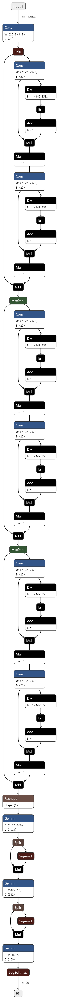

# CIFAR100
> The purpose of the project was to create a neural network to classify images from CIFAR100 dataset into 100 classes.

## Model

Two models were created in order to test different approaches. The model in "cifar100lightning.py" contains the script for building a classic ConvNet while "cifar100resnet.py" contains a simple ResNet. Both models were tested for accuracy and the ResNet model performed a lot better on the test dataset. 

*Computational graph*

## Technologies
* Python - version 3.8.3
* Numpy - version 1.18.5
* Pandas - version 1.0.5
* PyTorch - version 1.7.0 CUDA 10.1
* PyTorch-Lightning - version 1.0.6
